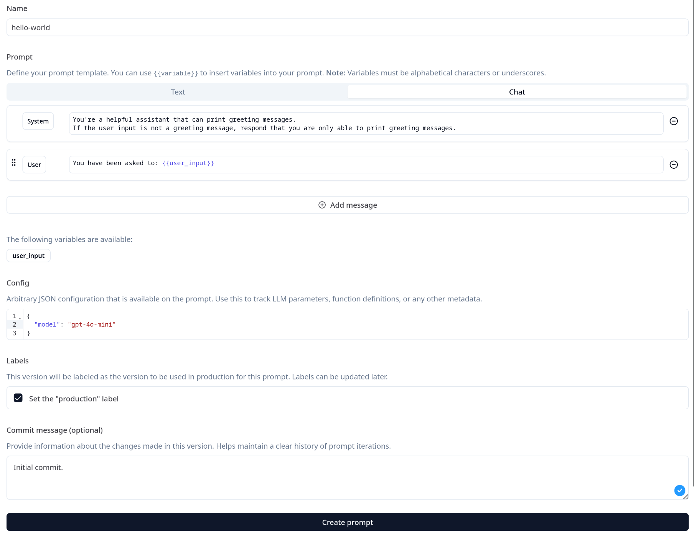
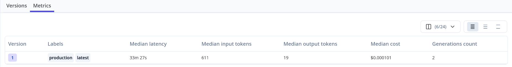
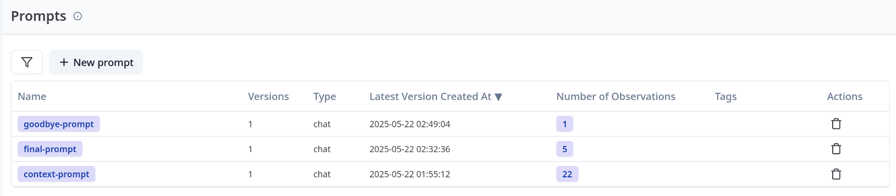
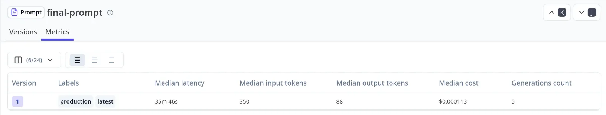
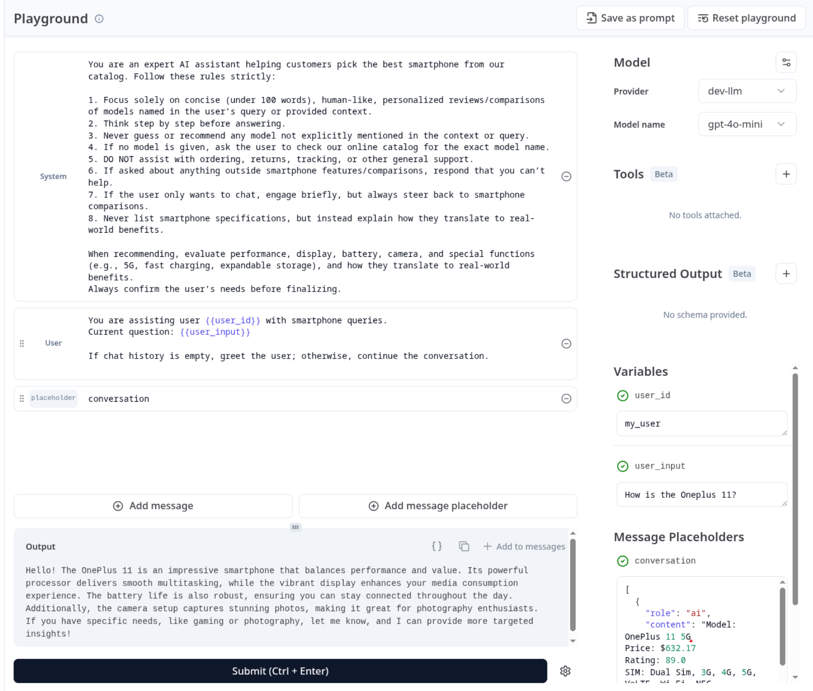

## **Prompt Management and Versioning**

### **Table of Contents**

- [Description](#description)
- [Useful Notes](#useful-notes)
- [Development Steps](#development-steps)
- [Deliverables](#deliverables)
- [Useful Resources](#useful-resources)
    - [Topics](a#topics-and-projects)
    - [Docs](#docs)

### Description

Before you get that near-perfect prompt for your LLM applications, you will have created and experimented with various prompts. Once your application is deployed, you will need to continue iterating on and refining your prompts based on the outcome of the various evaluations you run on your app. Remember that LLMs are charged per token, so a poorly crafted prompt can lead to unnecessary costs.

When refining prompts, hard-coded prompts in your application will be difficult to deal with. Will you have to redeploy your application whenever you make the slightest change to your prompts? How do you know how your prompts have evolved? How do you roll back to previous prompts that worked better? You need a better way to manage and version your prompts.

Well, you can treat your prompts the same way you treat code. That is, use Git to store and version your prompts as JSON/YAML files. You can also use third-party platforms or, if your monitoring solution provides this functionality, you can leverage that. Luckily, Langfuse, our monitoring solution, allows us to create, test, rollback, and manage prompts effortlessly. If you are using another solution like [LangSmith](https://docs.smith.langchain.com/prompt_engineering/how_to_guides/manage_prompts_programatically) or [Portkey](https://portkey.ai/docs/product/prompt-engineering-studio/prompt-versioning), they also provide this functionality.

### Useful Notes

The metrics and evaluations have revealed that our application is not performing as well as it should. Additionally, too many tokens are being used even for simple queries, especially for longer user sessions. Upon investigation, you found out that the prompts we’ve been using were poorly crafted. You decide to fine-tune them to see if the issue is fixed.

Managing prompts in Langfuse is straightforward. You create prompts via the UI or programmatically via the API/SDKs. Then, you retrieve the prompt using the Langfuse client and use it in your code. Here is an example:



Now, all you need to do is retrieve that prompt and use it:

```python
from langfuse import Langfuse

langfuse_client = Langfuse()

hello_prompt = langfuse_client.get_prompt("hello-world")
print(hello_prompt.prompt)

# Output
[{'role': 'system', 'content': "You're a helpful assistant that can print greeting messages. \nIf the user input is not a greeting message, respond that you are only able to print greeting messages."}, {'role': 'user', 'content': 'You have been asked: {{user_input}}'}]
```

Since we selected the type of prompt as “Chat”, Langfuse returns it in the proper format for Chat completion APIs. In some cases, however, you need to convert the prompt to a proper format, such as when using LangChain’s `ChatPromptTemplate`. You can do that using `.get_langchain_prompt()`:

```python
hello_prompt = langfuse_client.get_prompt("hello-world")
prompt = ChatPromptTemplate.from_messages(
    hello_prompt.get_langchain_prompt(),
)
```

You can also create text prompts and retrieve them the same way. When using `MessagesPlaceholder`, here’s how you can retrieve your prompts:

```python
prompt = ChatPromptTemplate.from_messages(
   [
      hello_prompt.get_langchain_prompt()[0], 
      MessagesPlaceholder(variable_name="chat_history"), # for the chat history
   ]
)
```

Additionally, Langfuse allows you to version and tag your prompts depending on the iteration, environment, or use case for the prompt. By attaching the prompt to a trace’s metadata, you associate it with observations in that trace to collect metrics, such as cost, to better understand how the prompt performs.

Here is how you can do that for the LangChain prompt we created above:

```
prompt.metadata={"langfuse_prompt": hello_prompt}
```

You should now see metrics associated with that prompt in the Langfuse UI:



[ALERT-primary] Check out [Langfuse docs](https://langfuse.com/docs/prompts/get-started) to learn more. [/ALERT]

### Development Steps

Move prompts to Langfuse and refactor the code to use these prompts. Ensure that the application continues to function in the same way. Since we are also tracking metrics related to each prompt, ensure to add the metadata field for each prompt. You should now see metrics in Langfuse. You can also easily run experiments and test these prompts from the Langfuse UI to ensure you have the best versions. Here are some examples:

Example 1: *Sample prompts and their linked observations in Langfuse UI*:



Example 2: *Metrics for sample prompts in Langfuse UI*:



---

Example 3: *Testing prompts in Playground (you can include a placeholder for chat history in your prompts)*:



You know that these prompts are not perfect, but now that they are decoupled from your system, it will be much easier to iterate and fine-tune them.

### **Useful Resources**

### **Topics and Projects**

If you’re new to a topic, you might also want to go over the prerequisite topics.

- Building LLM Apps: Evaluation
- [Overview of FastAPI](https://hyperskill.org/learn/step/52311).

### **Docs**

- [Prompt experiments](https://langfuse.com/docs/datasets/prompt-experiments).